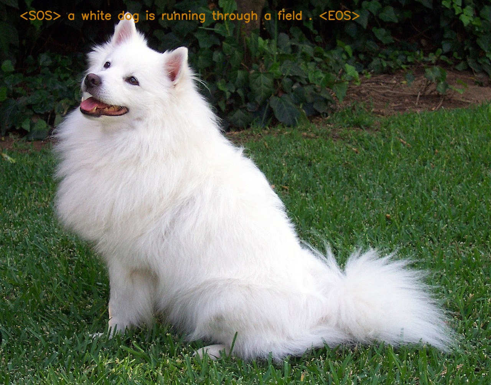

## CSE465 Project Summer 2022

## Project: Image Captioning Using CNN 

#### Requirements: `Pytorch, Torch Vision, Spacy, Tensorboard, PIL, TQDM`, python -m spacy download en

Download the dataset: [link](https://www.kaggle.com/dataset/e1cd22253a9b23b073794872bf565648ddbe4f17e7fa9e74766ad3707141adeb) 
and put it under `./data` make sure you unzip file folder and rename it from `flicker8k` to `data`

Download the Model Checkpoints [Gdrive_Link](https://drive.google.com/file/d/1H7YoXvwz_n9V-891MoSLIwogOX5cmK5N/view) and put it under `./Checkpoint` folder. #3Create an empty folder name checkpoint.

- Set images folder, captions.txt inside a folder Flickr8k.
- train.py: For training the CNN model.
- model.py: creating the encoderCNN, decoderRNN model and combine them together into one model. 
- get_loader.py: Loading the data, creating vocabulary for training, testing and evaluation.
- utils.py: Load model, save model, printing few test cases to evaluate the model.
- test.py: for testing the model with some example test images

for running text run this code

python test.py --image_path path_to_image --user_caption caption_user

#### To Run this Model.
- ##### Create a folder name `checkpoint`
- ##### For Training Start running the training script with `python train.py` 
- ##### For testing run the test.py script for default test images 
- ##### Use test.ipynb notebook to test the model and play with it.
